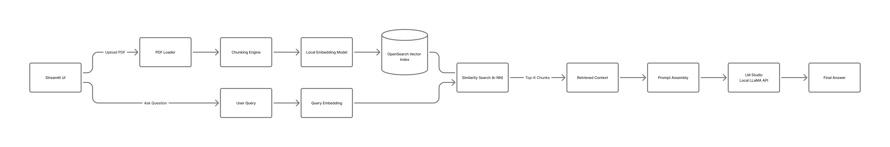

# Local RAG Assistant 🤖

A powerful, local-first Retrieval-Augmented Generation (RAG) system using OpenSearch for vector storage and LM Studio for local LLM inference.

## 🏗️ Architecture



The system follows a standard RAG pipeline:

1. **Ingestion**: PDFs are loaded, chunked using `RecursiveCharacterTextSplitter`, and embedded using `all-MiniLM-L6-v2`.
2. **Storage**: Chunks and embeddings are stored in an OpenSearch k-NN index.
3. **Retrieval**: User queries are embedded and used to find the most relevant chunks in OpenSearch.
4. **Generation**: The retrieved context is injected into a system prompt and sent to a local LLM via an OpenAI-compatible API.

## 📂 Project Structure

```text
RAG_T/
├── rag_api.py            # Main Starlette backend + static frontend server
├── frontend/             # Browser UI assets
├── app.py                # Legacy Streamlit prototype
├── src/                  # Core modules
│   ├── embeddings.py     # Embedding logic
│   ├── ingestion.py      # PDF processing and indexing
│   ├── llm_client.py     # LLM interaction utility
│   ├── rag_engine.py      # RAG orchestrator
│   └── vector_store.py   # OpenSearch interactions
├── prompts/              # System prompt templates
├── tests/                # Automated/Manual test scripts
├── scripts/              # Diagnostic and maintenance tools
└── assets/               # Documentation assets
```

## 🚀 Getting Started

### Recommended: Docker Compose

This repo now runs as a proper browser app backed by a Python API.
LM Studio still runs locally on your machine, and the app container connects to it through `host.docker.internal`.

1. Start LM Studio's local server on port `1234`.
2. Optionally copy `.env.example` to `.env` and tweak values.
3. Start the stack:

   ```bash
   docker compose up --build
   ```

4. Open the app at `http://localhost:8510`.

If LM Studio is bound to a non-default address or you want to target a specific loaded model, set:

```bash
LLM_BASE_URL=http://100.107.43.35:1234/v1
LLM_MODEL=zai-org/glm-4.6-v-flash
EMBEDDING_MODEL_NAME=text-embedding-nomic-embed-text-v1.5
EMBEDDING_BACKEND=openai
```

### OpenSearch Utility

If you only want to manage OpenSearch and run the legacy Streamlit prototype locally, use:

```bash
python scripts/opensearch_service.py up
```

Other supported actions:

- `python scripts/opensearch_service.py status`
- `python scripts/opensearch_service.py logs`
- `python scripts/opensearch_service.py restart`
- `python scripts/opensearch_service.py down`

### Prerequisites

- **Docker Desktop**: Required for the Docker Compose workflow.
- **LM Studio**: Or any OpenAI-compatible server running on port 1234.
- **Python 3.9+**

### Architecture Notes

The default app now separates concerns:

- **Frontend**: static browser UI in `frontend/`
- **Backend**: Starlette app in `rag_api.py`
- **Ingestion**: background job threads so large PDFs no longer block the UI lifecycle
- **RAG core**: existing `src/` modules reused behind API endpoints

### Local Python Installation

1. Clone the repository and navigate to the project directory.
2. Install dependencies:

   ```bash
   pip install -r requirements.txt
   ```
3. Start OpenSearch with Docker:

   ```bash
   python scripts/opensearch_service.py up
   ```
4. Run the app locally:

   ```bash
   uvicorn rag_api:app --host 0.0.0.0 --port 8510
   ```

### Configuration

The app can be configured with environment variables:

- `LLM_BASE_URL` default: `http://localhost:1234/v1`
- `LLM_MODEL` default: `local-model`
- `OPENSEARCH_URL` default: `http://localhost:9200`
- `DEFAULT_INDEX_NAME` default: `pdf-rag`
- `EMBEDDING_MODEL_NAME` default: `all-MiniLM-L6-v2`
- `EMBEDDING_BACKEND` default: `auto`
- `EMBEDDING_BASE_URL` default: `LLM_BASE_URL`
- `OPENSEARCH_VERIFY_CERTS` default: `false`

Inside Docker Compose, `OPENSEARCH_URL` is automatically set to `http://opensearch:9200`.

### Running the App

```bash
uvicorn rag_api:app --host 0.0.0.0 --port 8510
```

### API Endpoints

- `GET /api/health`
- `POST /api/ingest`
- `GET /api/jobs`
- `GET /api/jobs/{job_id}`
- `POST /api/query`
- `GET /api/indexes/{index_name}`

### Ingestion

You can upload and index PDFs directly through the browser UI. Ingestion runs as a background job, and the frontend polls for job progress.

### Legacy Streamlit Prototype

The old Streamlit UI still exists in `app.py` for reference, but it is no longer the recommended runtime for very large uploads.

## 🛠️ Development & Diagnostics

- **Run Tests**: `python tests/test_rag_engine.py`
- **Check Mapping**: `python scripts/diag_opensearch.py`
- **Reset Indices**: `python scripts/reset_os_indices.py`
- **Manage OpenSearch**: `python scripts/opensearch_service.py <up|down|restart|logs|status>`

## 📊 Performance Tracking

The system tracks search latency and LLM token usage for every query, providing transparency into the RAG process.
